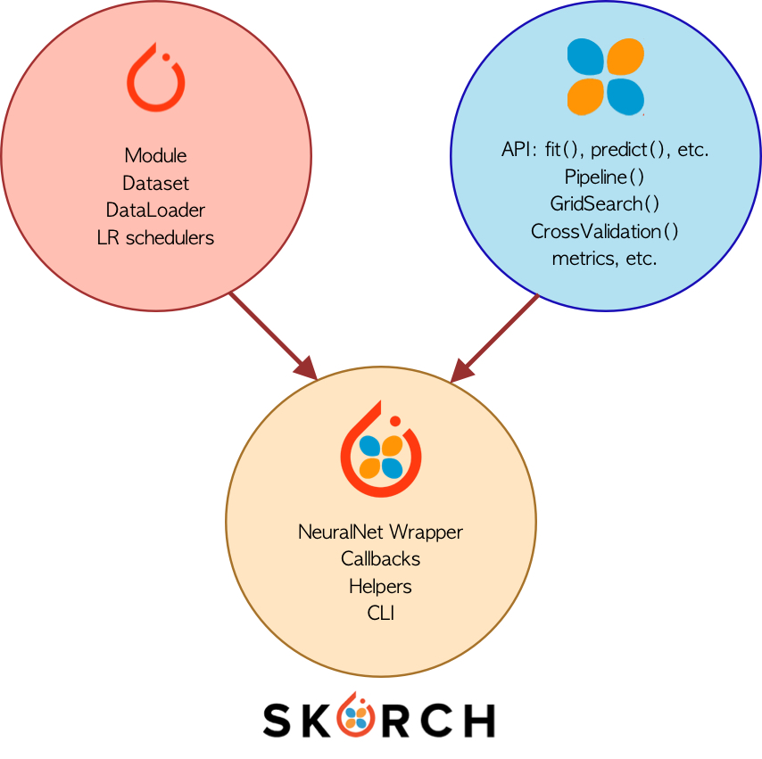

<!-- PROJECT SHIELDS -->
<!--
*** I'm using markdown "reference style" links for readability.
*** Reference links are enclosed in brackets [ ] instead of parentheses ( ).
*** See the bottom of this document for the declaration of the reference variables
*** for contributors-url, forks-url, etc. This is an optional, concise syntax you may use.
*** https://www.markdownguide.org/basic-syntax/#reference-style-links
-->
[![Medium][medium-shield]][medium-url]
[![Twitter][twitter-shield]][twitter-url]
[![Linkedin][linkedin-shield]][linkedin-url]

# SKORCH: PyTorch Models Trained with a Scikit-Learn Wrapper
This repository shows an example of the usability of SKORCH to train a PyTorch model making use of different capabilities of the scikit-learn framework.

If you want to understand the details about how this model was created, take a look at this very clear and detailed explanation: <a href="https://towardsdatascience.com/skorch-pytorch-models-trained-with-a-scikit-learn-wrapper-62b9a154623e"> SKORCH: PyTorch Models Trained with a Scikit-Learn Wrapper </a>

<!-- TABLE OF CONTENTS -->
## Table of Contents

* [The model](#the-model)
* [Files](#files)
* [How to use](#how-to-use)
* [Contributing](#contributing)
* [Contact](#contact)
* [License](#license)

<!-- the-model -->
## 1. The model
The idea of this repository is to show how to use some of the SKorch functionalities to train a PyTorch model. In this case, a neural network was created to classify the wines dataset. In order to understand better what SKorch is, take a look at the following image:

<p align="center">

</p>

<!-- files -->
## 2. Files
* **data**: Here you will find the wines dataset
* **src**: It contains two files ``data_loader.py`` and ``model.py``. The file ``data_loader.py``contains the functions to load an preprocess the wines dataset. The file ``model.py``contains the PyTorch model.
* **main.py**: This file trigger the different cases explained in the Medium article.


<!-- how-to-use -->
## 3. How to use
You just need to type

```SH
python main.py
```
however, I recommend you to work with a virtual environment, in this case I am using pipenv. So in order to install the dependencies located in the ``Pipfile`` you just need to type:

```SH
pipenv install
```
and then

```SH
pipenv shell
```

<!-- contributing -->
## 4. Contributing
Feel free to fork the model and add your own suggestiongs.

1. Fork the Project
2. Create your Feature Branch (`git checkout -b feature/YourGreatFeature`)
3. Commit your Changes (`git commit -m 'Add some YourGreatFeature'`)
4. Push to the Branch (`git push origin feature/YourGreatFeature`)
5. Open a Pull Request

<!-- contact -->
## 5. Contact
If you have any question, feel free to reach me out at:
* <a href="https://twitter.com/Fernando_LpzV">Twitter</a>
* <a href="https://medium.com/@fer.neutron">Medium</a>
* <a href="https://www.linkedin.com/in/fernando-lopezvelasco/">Linkedin</a>
* Email: fer.neutron@gmail.com

<!-- license -->
## 6. License
Distributed under the MIT License. See ``LICENSE.md`` for more information.


<!-- MARKDOWN LINKS & IMAGES -->
<!-- https://www.markdownguide.org/basic-syntax/#reference-style-links -->
[medium-shield]: https://img.shields.io/badge/medium-%2312100E.svg?&style=for-the-badge&logo=medium&logoColor=white
[medium-url]: https://medium.com/@fer.neutron
[twitter-shield]: https://img.shields.io/badge/twitter-%231DA1F2.svg?&style=for-the-badge&logo=twitter&logoColor=white
[twitter-url]: https://twitter.com/Fernando_LpzV
[linkedin-shield]: https://img.shields.io/badge/linkedin-%230077B5.svg?&style=for-the-badge&logo=linkedin&logoColor=white
[linkedin-url]: https://www.linkedin.com/in/fernando-lopezvelasco/